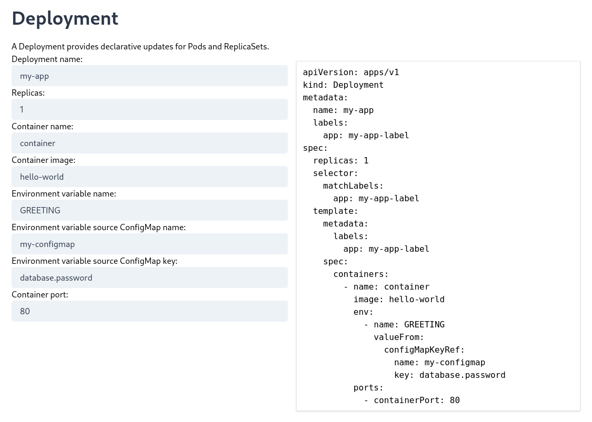

# 💅 manikure - Manifest Builder for Kubernetes Resources

🔎 **A single-page web application for creating Kubernetes resource definitions (JSON/YAML manifests).** Built with: VueJS, TailwindCSS, sweat+tears.



> This is a personal project, developed when I realised I was fed up of writing Kubernetes manifests all the time. This project is also my playground for learning modern front-end development (I'm normally a back-end engineer so this is a bit of a change for me!) 👴 I don't work on this project regularly but will be coming back to it infrequently to update and add new features. Your issues and pull requests are welcome!

**Latest news (24/09/2023):** I've just updated this to Vue v3. `npm` sapped my will to live.

## Future roadmap

- Support for more fields in the core objects (Pod, Deployment, Service)
- Support for dynamic fields in objects (e.g. environment variables, volumes)
- Combine multiple objects into a Kubernetes List or OpenShift Template
- Support for creating Helm charts
- Make it look nicer

## Project setup

If you want to build and run this application locally, you'll need NPM installed:

```
npm install
```

Compile and hot-reload for development (starts a web server and enables hot-reload):

```
npm run serve
```

Compile and minify for production (builds the application into the `dist/` folder):

```
npm run build
```

Do some linting or something:

```
npm run lint
```

## Licence

(c) 2020 Tom Donohue and authors. This software is shared here under the [GPL-3.0 License](LICENSE). You are free to copy, distribute or modify, by following the terms of the licence.

### What does this licence mean?

You may copy, distribute and modify the software as long as you track changes/dates in source files. **Any modifications to or software including (via compiler) GPL-licensed code must also be made available under the GPL along with build & install instructions.**

For a plain English explanation of the licence, see [this guide](https://www.tldrlegal.com/license/gnu-general-public-license-v3-gpl-3).
