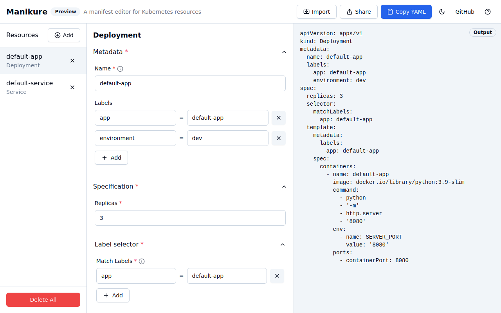

<div align="center">
    <h1>💅 manikure</h1>
    <p><strong>Interactive editor for Kubernetes resources</strong></p>
    <p><strong>Design and validate your Kubernetes configurations... <em>without having to remember all of that YAML!</em></strong></p>
</div>

<hr/>

<p align="center">
    
</p>
<p align="center">
    <a href="https://manikure.netlify.app"><strong>👉 Try it out now: manikure.netlify.app 👈</strong></a>
</p>

<hr/>

<div align="center">
    
</div>

🔎 **Manikure is a single-page web application for designing Kubernetes resource definitions (JSON/YAML manifests).** It's ideal for when you're learning how to write Kubernetes resources, or when you want to quickly prototype a new resource.

## Features

- **Interactive editor:** Design your Kubernetes resources using a visual editor, without writing YAML.
- **Templates:** Use pre-defined templates to get started quickly. Choose from a set of typical Kubernetes scenarios.
- **Export:** Export your resources as YAML, ready to apply to your Kubernetes cluster.
- **Share:** Share your resources with others, by exporting them as a URL.
- **Dark mode:** Because everyone loves dark mode.
- **No server required:** The app runs entirely in your browser, with no server-side processing.

## Future roadmap

- [ ] Support for more fields in the core objects (Pod, Deployment, Service)
- [x] Support for dynamic fields in objects (e.g. environment variables, volumes) (implemented using Zod/AutoForm)
- [ ] Combine multiple objects into a Kubernetes List or OpenShift Template
- [ ] Support for creating Helm charts
- [x] Make it look nicer (Now done using shadcn-vue!)

## Getting started

### Use in your browser

You can use Manikure in your browser without having to install it.

Simply head to https://manikure.netlify.app.

### Run locally

If you want to build and run this application locally, you'll need _npm_ installed:

```shell
# Install
npm install

# Compile and hot-reload for development (starts a web server and enables hot-reload):
npm run dev
```

This will start a development server at `http://localhost:5173`.

If you want to create a production build of the application (builds the application's HTML, CSS and JS into the `dist/` folder):

```
npm run build
```

## Licence

(c) 2020-2025 Tom Donohue and authors. This is free software. It's provided to you under the terms of the [AGPL-3.0 License](LICENSE). You are free to copy, distribute or modify, but you must follow the terms of the licence.

### What does this licence mean?

You may copy, distribute and modify the software as long as you make your modifications available under the AGPL, along with build & install instructions.

The AGPL terms mean that these conditions also apply if you're providing this software over a network. If you're doing that, the corresponding **source code** of your modified version(s) of the software must be prominently **offered to all users** who interact with it.

For a plain English explanation of the licence, see [this guide](https://www.tldrlegal.com/license/gnu-affero-general-public-license-v3-agpl-3-0).
